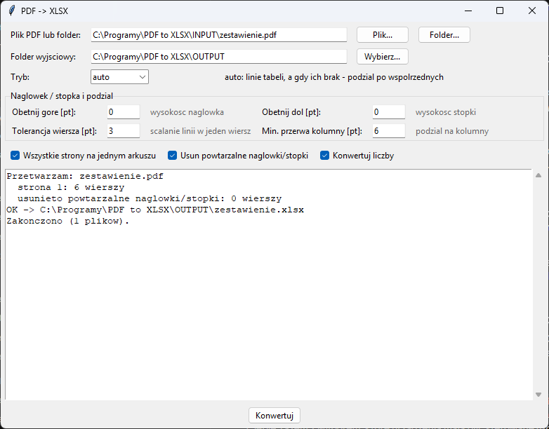

# PDF to XLSX (program lokalny)

Program **lokalny** — działa w całości na Twoim komputerze (Python + tkinter),
nigdzie nie wysyła Twoich plików PDF ani danych. Z internetem łączy się
tylko po to, żeby sprawdzić [aktualizacje](#aktualizacje).

Program z GUI (tkinter) do wyciągania tabel z plików PDF do Excela (.xlsx).
Radzi sobie z PDF-ami bez linii siatki tabeli — dane ułożone "wierszami"
(wiersz, mały odstęp, kolejny wiersz) są rozpoznawane po współrzędnych
tekstu, nie po liniach.



## Instalacja (jednorazowo)

1. **Python** — pobierz z [python.org](https://www.python.org/downloads/windows/)
   (wersja 3.9 lub nowsza). W instalatorze zaznacz **„Add python.exe to PATH”**.
   Opcja „tcl/tk and IDLE” jest zaznaczona domyślnie i musi taka zostać.
   Uprawnienia administratora nie są potrzebne.
2. **Program** — na stronie [github.com/DawidBochno/pdf-to-xlsx](https://github.com/DawidBochno/pdf-to-xlsx)
   kliknij zielony przycisk **Code → Download ZIP**. Rozpakuj archiwum,
   np. do `C:\Programy\PDF to XLSX`. Nie uruchamiaj programu z wnętrza ZIP-a.
3. Kliknij dwukrotnie **`install.bat`**. Instaluje biblioteki `pdfplumber` i `openpyxl` (potrzebny internet) i uruchamia test. Na końcu pojawia się
   **„selftest OK”**, co znaczy, że wszystko działa.
   Jeśli Windows pokaże „System Windows ochronił ten komputer”, kliknij
   **Więcej informacji → Uruchom mimo to**.
4. Program uruchamia się plikiem **`uruchom.bat`**. Wygodnie jest zrobić
   skrót na pulpicie: prawy przycisk na `uruchom.bat` → **Wyślij do →
   Pulpit (utwórz skrót)**.

## Użycie

W GUI wskaż:
- **Plik PDF lub folder** — pojedynczy plik albo folder z wieloma PDF-ami
  (tryb wsadowy — każdy plik trafia do osobnego .xlsx).
- **Folder wyjściowy** — gdzie zapisać wynikowe pliki .xlsx.
- **Tryb**:
  - `auto` (domyślny) — najpierw próbuje wykryć tabele po liniach siatki
    PDF, a gdy ich nie ma, dzieli tekst po współrzędnych.
  - `tabele` — wymusza wykrywanie po liniach siatki.
  - `wiersze` — wymusza dzielenie po współrzędnych (dla PDF-ów bez siatki).

### Nagłówek / stopka i podział na kolumny

- **Obetnij górę / dół [pt]** — wycina pas strony (np. nagłówek firmy,
  stopka z numerem strony) przed ekstrakcją.
- **Tolerancja wiersza [pt]** — jak blisko pionowo muszą być fragmenty
  tekstu, żeby uznać je za ten sam wiersz (zwiększ, jeśli jeden wiersz
  danych rozjeżdża się na dwa).
- **Min. przerwa kolumny [pt]** — minimalna pionowa przerwa bez tekstu,
  żeby uznać ją za granicę kolumny (zwiększ, jeśli kolumny dzielą się
  za często; zmniejsz, jeśli sąsiednie kolumny się sklejają).
- **Usuń powtarzalne nagłówki/stopki** — usuwa wiersze z góry strony,
  które na większości stron stoją w tym samym miejscu (np. tytuł dokumentu,
  nagłówek tabeli), i z dołu strony, jeśli są na każdej stronie (stopka). Powtarzające się wiersze danych ze środka strony
  zostają. Usunięte wiersze są wypisane w logu.
- **Wszystkie strony na jednym arkuszu** — inaczej każda strona trafia
  do osobnego arkusza w tym samym pliku .xlsx.
- **Konwertuj liczby** — zamienia tekst typu `1 234,56` na liczbę Excela.
  Numery kont (ponad 15 cyfr) i kody z zerem na początku (`007`, `00123`)
  zostają tekstem, żeby nic nie zginęło.

## Aktualizacje

Po uruchomieniu program sprawdza w tle na GitHubie, czy jest nowa wersja.
Jeśli jest, pyta **„Pobrać i zainstalować teraz?”**. Pobierane są tylko
zmienione pliki programu. Foldery `INPUT`, `OUTPUT`, ustawienia i pliki
w `przyklad/` nie są nadpisywane. Po aktualizacji zamknij i uruchom program ponownie. Jeśli program
o to poprosi, uruchom też raz `install.bat` (zmieniły się biblioteki).

- Do GitHuba trafia tylko zapytanie o listę plików programu, **nigdy
  dokumenty ani dane**.
- Bez internetu albo przy blokadzie (np. UTM) program działa normalnie,
  bez żadnego komunikatu.
- **Wyłączenie** (np. gdy programy aktualizuje dział IT): utwórz w folderze
  programu pusty plik o nazwie `NIE_AKTUALIZUJ`.
- Kopię pobraną przez `git clone` aktualizuje się poleceniem `git pull`.

## Ograniczenia

- Działa tylko na PDF-ach z warstwą tekstową — skany bez OCR nie są
  obsługiwane.
- Wiersze zawijane na dwie linie (np. długa nazwa produktu) nie są
  automatycznie scalane w jeden wiersz tabeli.

## Testy

```bash
python pdf_to_xlsx.py --selftest
```

Uruchamia test logiki grupowania w wiersze, wykrywania kolumn i
konwersji wartości liczbowych.
